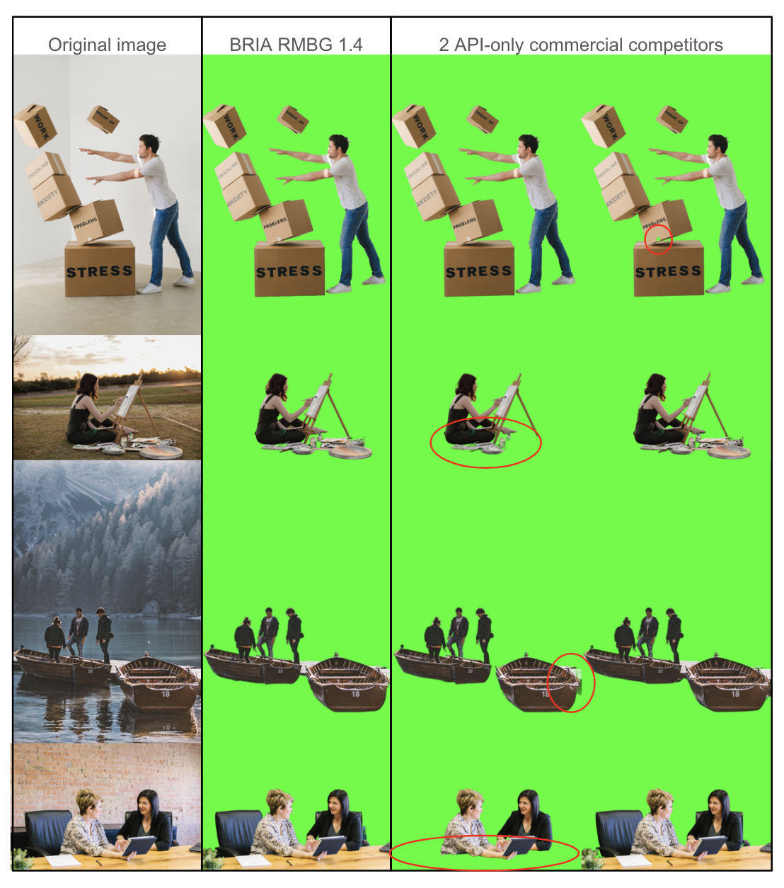

# BRIA Background Removal v1.4 Model Card

Repo is a fork of https://huggingface.co/briaai/RMBG-1.4 

 

RMBG v1.4 is our state-of-the-art background removal model, designed to effectively separate foreground from background in a range of
categories and image types. This model has been trained on a carefully selected dataset, which includes:
general stock images, e-commerce, gaming, and advertising content, making it suitable for commercial use cases powering enterprise content creation at scale. 
The accuracy, efficiency, and versatility currently rival leading open source models. 
It is ideal where content safety, legally licensed datasets, and bias mitigation are paramount. 

Developed by BRIA AI, RMBG v1.4 is available as an open-source model for non-commercial use. 

[CLICK HERE FOR A DEMO](https://huggingface.co/spaces/briaai/BRIA-RMBG-1.4)

### Model Description

- **Developed by:** [BRIA AI](https://bria.ai/)
- **Model type:** Background Removal 
- **License:** [bria-rmbg-1.4](https://bria.ai/bria-huggingface-model-license-agreement/)
  - The model is released under an open-source license for non-commercial use.
  - Commercial use is subject to a commercial agreement with BRIA. [Contact Us](https://bria.ai/contact-us) for more information. 

- **Model Description:** BRIA RMBG 1.4 is a saliency segmentation model trained exclusively on a professional-grade dataset.
- **BRIA:** Resources for more information: [BRIA AI](https://bria.ai/)

## Training data
Bria-RMBG model was trained with over 12,000 high-quality, high-resolution, manually labeled (pixel-wise accuracy), fully licensed images.
Our benchmark included balanced gender, balanced ethnicity, and people with different types of disabilities.
For clarity, we provide our data distribution according to different categories, demonstrating our model’s versatility.

### Distribution of images:

| Category | Distribution |
| -----------------------------------| -----------------------------------:|
| Objects only | 45.11% |
| People with objects/animals | 25.24% |
| People only | 17.35% |
| people/objects/animals with text | 8.52% |
| Text only | 2.52% |
| Animals only | 1.89% |

| Category | Distribution |
| -----------------------------------| -----------------------------------------:|
| Photorealistic | 87.70% |
| Non-Photorealistic | 12.30% |

| Category | Distribution |
| -----------------------------------| -----------------------------------:|
| Non Solid Background | 52.05% |
| Solid Background | 47.95% 

| Category | Distribution |
| -----------------------------------| -----------------------------------:|
| Single main foreground object | 51.42% |
| Multiple objects in the foreground | 48.58% |

## Qualitative Evaluation

## Architecture

RMBG v1.4 is developed on the [IS-Net](https://github.com/xuebinqin/DIS) enhanced with our unique training scheme and proprietary dataset. 
These modifications significantly improve the model’s accuracy and effectiveness in diverse image-processing scenarios.
